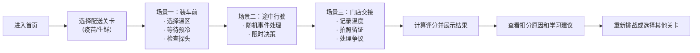

## 1. 产品概述

冷链新司机温控任务训练游戏，为冷链物流行业新入职司机和职业院校物流专业学生设计的轻量互动式培训工具。通过模拟真实配送场景中的温控决策，让学习者在游戏中理解每个温控操作的重要性，而非通过严肃考试进行考核。

- **核心目标**：通过沉浸式互动体验，让新司机掌握冷链配送全流程的温控规范
- **目标用户**：冷链公司新入职司机、职业院校物流专业学生
- **产品价值**：降低培训成本，提高培训效率，减少实际配送中的货损风险和合规问题

## 2. 核心功能

### 2.1 用户角色

| 角色 | 注册方式 | 核心权限 |
|------|----------|----------|
| 学员用户 | 无需注册，直接进入 | 选择关卡、进行游戏、查看评分和学习反馈 |

### 2.2 功能模块

1. **首页/关卡选择页**：游戏介绍、关卡选择（疫苗配送/生鲜配送）、历史最佳成绩
2. **游戏主页面**：三个场景的互动决策（装车前、途中行驶、门店交接）
3. **结果反馈页**：温控合规分、货损风险、客户投诉风险、扣分点原因解释

### 2.3 页面详情

| 页面名称 | 模块名称 | 功能描述 |
|---------|----------|----------|
| 首页 | 英雄区域 | 游戏标题、主题动画、"开始训练"按钮 |
| 首页 | 关卡选择 | 疫苗配送关卡卡、生鲜配送关卡卡、难度标识 |
| 首页 | 规则说明 | 简要游戏规则和温控知识提示 |
| 游戏页 | 场景导航 | 显示当前场景进度（装车前→途中→交接） |
| 游戏页 | 场景内容区 | 动态场景描述、选择题选项、倒计时计时器 |
| 游戏页 | 实时状态面板 | 当前温度、车厢状态、时间进度 |
| 游戏页 | 事件弹窗 | 途中随机事件的紧急处理弹窗 |
| 结果页 | 评分仪表盘 | 三个维度的分数可视化展示 |
| 结果页 | 扣分详情 | 每个错误决策的扣分点和原因解释 |
| 结果页 | 学习总结 | 本次游戏的知识点总结和改进建议 |
| 结果页 | 操作按钮 | 重新挑战、返回关卡选择 |

## 3. 核心流程

玩家选择配送关卡后，依次经历三个场景的决策挑战。每个场景包含多个决策点，部分决策有时间限制。最终根据所有决策计算三项评分。

## 4. 用户界面设计

### 4.1 设计风格

- **主色调**：冷链蓝（#0EA5E9）作为主色，代表专业和低温；警示红（#EF4444）用于风险提示；安全绿（#10B981）用于正确操作反馈
- **辅助色**：冰蓝色渐变背景，营造冷链氛围
- **按钮风格**：圆角卡片式按钮，带有微妙的悬停动效和阴影层次
- **字体**：标题使用具有科技感的现代无衬线字体，正文使用清晰易读的中文字体
- **布局风格**：卡片式布局，层次分明，重点信息突出显示
- **图标风格**：使用线条图标，配合温控相关的emoji增强视觉识别（❄️🌡️🚚📦）

### 4.2 页面设计概述

| 页面名称 | 模块名称 | UI元素 |
|---------|----------|--------|
| 首页 | 英雄区域 | 大型渐变背景、冷链卡车动画图标、主标题"冷链温控训练营"、副标题"成为专业冷链司机的第一步" |
| 首页 | 关卡选择 | 两张横向卡片，分别展示疫苗配送（蓝色调、医疗图标）和生鲜配送（绿色调、食品图标），hover时有上浮效果 |
| 首页 | 规则说明 | 简洁的三步流程图标，配合简短文字说明 |
| 游戏页 | 场景导航 | 顶部进度条，三个节点用连接线，当前场景高亮显示 |
| 游戏页 | 场景内容 | 左侧场景描述卡片，右侧选项卡片区，选项带有悬停动效 |
| 游戏页 | 实时状态 | 顶部固定状态栏，显示当前温度（带颜色指示）、车厢状态图标、时间进度条 |
| 游戏页 | 事件弹窗 | 模态弹窗，紧急事件用红色边框闪烁，倒计时数字动画 |
| 结果页 | 评分仪表盘 | 三个圆形仪表盘，分别显示合规分、货损风险、投诉风险，带有进度动画 |
| 结果页 | 扣分详情 | 时间线式布局，每个决策点标注正确/错误，展开可看详细解释 |
| 结果页 | 学习总结 | 卡片式布局，列出3-5个关键知识点 |

### 4.3 响应式设计

- **桌面端优先**：1280px及以上为最佳体验，采用两栏式布局
- **平板适配**：768px-1279px，调整为单栏布局，卡片宽度自适应
- **手机适配**：375px-767px，简化导航，按钮尺寸增大，优化触控体验

### 4.4 动画与交互

- **页面切换**：淡入淡出+滑动过渡动画
- **选择反馈**：正确选项绿色闪光，错误选项红色震动
- **倒计时**：最后5秒数字变红并闪烁
- **温度变化**：温度数值带有平滑过渡动画
- **事件触发**：紧急事件弹窗带有脉冲动画效果
- **评分展示**：仪表盘数值从0滚动到最终得分
