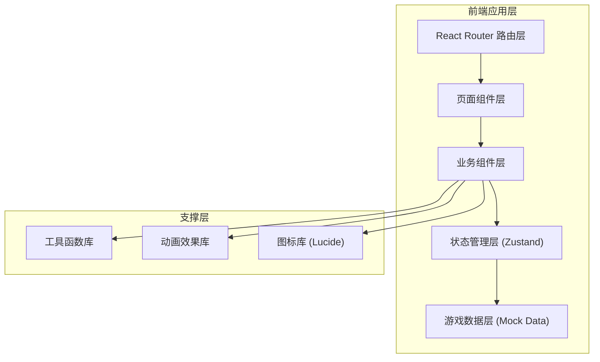

## 1. 架构设计

本项目为纯前端单页应用，无需后端服务。使用React + TypeScript + Vite构建，状态管理采用Zustand，样式使用TailwindCSS。



## 2. 技术描述

- **前端框架**：React@18 + TypeScript
- **构建工具**：Vite@5
- **状态管理**：Zustand@4
- **路由管理**：React Router DOM@6
- **样式方案**：TailwindCSS@3
- **图标库**：Lucide React
- **动画方案**：CSS动画 + Framer Motion（可选，用于复杂动画）
- **后端**：无（纯前端应用，数据内置）
- **数据库**：无（使用localStorage存储历史成绩）

## 3. 路由定义

| 路由 | 页面 | 功能描述 |
|------|------|----------|
| `/` | 首页/关卡选择 | 游戏介绍、关卡选择、历史成绩 |
| `/game/:levelId` | 游戏主页面 | 三个场景的互动决策 |
| `/result/:levelId` | 结果反馈页 | 评分展示、扣分详情、学习总结 |

## 4. 数据模型

### 4.1 核心类型定义

```typescript
// 关卡类型
interface Level {
  id: string;
  name: string;
  description: string;
  icon: string;
  difficulty: 'easy' | 'medium' | 'hard';
  targetTemp: { min: number; max: number };
  scenes: Scene[];
}

// 场景类型
interface Scene {
  id: string;
  name: string;
  description: string;
  decisions: Decision[];
}

// 决策点类型
interface Decision {
  id: string;
  question: string;
  description: string;
  options: Option[];
  timeLimit?: number; // 秒，null表示无时间限制
  isRandomEvent?: boolean;
}

// 选项类型
interface Option {
  id: string;
  text: string;
  consequence: Consequence;
}

// 决策后果类型
interface Consequence {
  complianceScore: number; // 合规分变动
  damageRisk: number; // 货损风险变动
  complaintRisk: number; // 投诉风险变动
  temperatureChange: number; // 温度变化
  feedback: string; // 即时反馈
  explanation: string; // 详细解释（结果页展示）
}

// 游戏状态类型
interface GameState {
  currentLevelId: string | null;
  currentSceneIndex: number;
  currentDecisionIndex: number;
  temperature: number;
  complianceScore: number; // 0-100
  damageRisk: number; // 0-100，越低越好
  complaintRisk: number; // 0-100，越低越好
  decisionHistory: DecisionRecord[];
  isGameOver: boolean;
}

// 决策记录类型
interface DecisionRecord {
  decisionId: string;
  selectedOptionId: string;
  isCorrect: boolean;
  consequence: Consequence;
  timestamp: number;
}

// 最终结果类型
interface GameResult {
  levelId: string;
  levelName: string;
  complianceScore: number;
  damageRisk: number;
  complaintRisk: number;
  decisionHistory: DecisionRecord[];
  keyLearnings: string[];
  overallRating: 'excellent' | 'good' | 'pass' | 'fail';
}
```

### 4.2 游戏数据结构

```typescript
// 关卡数据示例
const levels: Level[] = [
  {
    id: 'vaccine',
    name: '疫苗配送任务',
    description: '将一批新冠疫苗从配送中心运往社区接种点，温度要求严格控制在2-8℃',
    icon: '💉',
    difficulty: 'hard',
    targetTemp: { min: 2, max: 8 },
    scenes: [
      {
        id: 'loading',
        name: '装车前检查',
        decisions: [
          {
            id: 'zone-select',
            question: '根据疫苗包装箱上的温度标签，你应该将货物装入哪个温区？',
            options: [
              { id: 'a', text: '冷冻区（-18℃以下）', consequence: { ... } },
              { id: 'b', text: '冷藏区（2-8℃）', consequence: { ... } },
              { id: 'c', text: '恒温区（15-25℃）', consequence: { ... } }
            ]
          }
          // 更多决策点...
        ]
      }
      // 更多场景...
    ]
  }
  // 更多关卡...
];
```

## 5. 项目结构

```
src/
├── components/          # 可复用组件
│   ├── layout/         # 布局组件
│   ├── game/           # 游戏相关组件
│   ├── ui/             # 基础UI组件
│   └── common/         # 通用组件
├── pages/              # 页面组件
│   ├── Home.tsx        # 首页
│   ├── Game.tsx        # 游戏页
│   └── Result.tsx      # 结果页
├── store/              # 状态管理
│   └── useGameStore.ts
├── data/               # 游戏数据
│   └── levels.ts       # 关卡配置数据
├── types/              # TypeScript类型定义
│   └── game.ts
├── utils/              # 工具函数
│   ├── scoring.ts      # 评分计算
│   └── animation.ts    # 动画工具
├── hooks/              # 自定义Hooks
│   ├── useTimer.ts     # 倒计时Hook
│   └── useGameFlow.ts  # 游戏流程Hook
├── App.tsx             # 应用入口
├── main.tsx            # React入口
└── index.css           # 全局样式
```

## 6. 关键技术实现

### 6.1 状态管理设计

使用Zustand管理游戏全局状态，包含：
- 游戏进度状态（当前关卡、场景、决策点）
- 实时数值状态（温度、三项评分）
- 决策历史记录
- 游戏控制方法（开始、选择选项、前进场景、重置等）

### 6.2 游戏流程控制

- 使用自定义Hook `useGameFlow` 管理场景切换逻辑
- 途中随机事件采用触发式设计，根据概率随机插入
- 倒计时功能使用 `useTimer` Hook，支持暂停、重置

### 6.3 评分算法

- **温控合规分**：基础分100，每个错误决策根据严重程度扣5-20分
- **货损风险**：基础分0，每个错误决策增加5-25分，温度超标额外增加
- **客户投诉风险**：基础分0，影响客户体验的决策增加相应分数

### 6.4 动画实现

- 页面过渡：使用CSS transition实现淡入淡出
- 微交互：使用TailwindCSS的hover、active状态
- 复杂动画：评分仪表盘滚动动画、事件弹窗脉冲效果使用requestAnimationFrame或CSS keyframes

### 6.5 本地存储

- 使用localStorage存储历史最佳成绩
- 存储键名：`cold_chain_best_scores`
- 存储格式：`{ [levelId]: { complianceScore, date } }`
